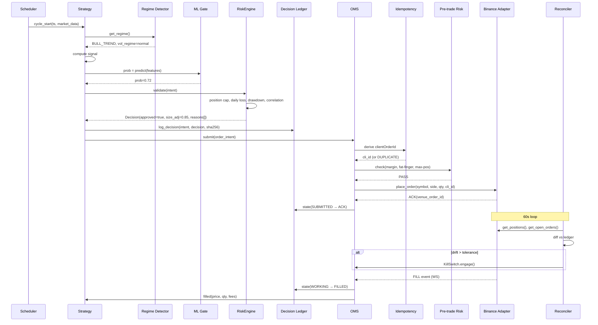

# AAATS — Deep Stress Test, Strategic Direction, and vNext Blueprint

**Author:** AI engineering review for Puneeth M.P.
**Date:** 2026-05-10
**Scope:** Full architectural stress test, Binance paper-trading verdict, monitoring stack comparison, Polymarket analysis, optimized vNext blueprint, self-rated final recommendation
**Tone:** Ruthless mentor. No fluff. Quant architect / systems engineer perspective.

---

## TL;DR (read this first)

**Stress-test verdict:** AAATS as-is has the right skeleton but six load-bearing gaps that will cause silent failure in live trading. Listed in section 3.

**Binance paper trading verdict:** Binance Spot Testnet and Futures Testnet are **broken for strategy validation** — testnet prices diverge wildly from mainnet, funding rates are fake, liquidation engine diverges, state wipes monthly. Binance Demo Trading on the mainnet UI has perfect prices but **zero API**. **Solution: build a hybrid live-mainnet-data + simulated-execution engine inside AAATS itself, using NautilusTrader as the backtest/sandbox/live runtime so there is zero implementation drift.**

**Monitoring stack verdict:** Grafana + Prometheus for time-series (you have it), **structured event log in Postgres** as the backbone (missing), Streamlit only for an operator console (not a monitoring tool), TradingView as a *manual analyst* tool not an integration target, and a small AI-monitoring layer for log summarization (not for alerting).

**Polymarket verdict: DO NOT INTEGRATE.** It's crypto-adjacent infrastructure for a non-crypto trading business, but the **PROGA 2025 + MeitY VPN directive + FIU USDC-screening rules = effectively illegal and operationally impossible for an Indian resident in 2026**, regardless of capital scope. ED enforcement of offshore wagering flows is non-bailable. The juice is not worth the squeeze.

**Strategic direction verdict:** Crypto-only + AI-**assisted** (not AI-autonomous) is the correct path. Drop "AI-driven autonomous" from the AAATS positioning. The right framing: **deterministic execution engine, AI-supervised research/postmortem/regime layer, human-in-the-loop for capital allocation changes.** This is what survives — pure-LLM-decisioning systems do not have a public live track record.

**Final rating:** **6.5/10** for the current AAATS direction (with reasoning in section 11). Becomes **8/10** with the eight specific changes in this document. Becomes **9/10** if you also adopt NautilusTrader as the runtime foundation rather than building the engine yourself.

---

## 1. AAATS Architecture As-Is — What's Right

Before stress-testing, credit where it's due. From your memory and prior work you have:

- A 12-strategy universe with explicit entry/exit rules, capital allocation, and recovery protocol — most retail systems never get this far.
- Live observability stack: Grafana (45-panel command center), Prometheus, Postgres, Redis, Telegram bot, Cloudflared, deployed on Tailscale-only Contabo VPS.
- Doctrine of `0.5-0.8%/day target, 14-day paper minimum, 24h kill-switch cooldown, no strategy adds during drawdown` — this is more discipline than 95% of retail algo operators.
- Working knowledge that LLMs do not belong in execution paths (per prior session).
- Clear separation between paper validation phase and live capital deployment.
- Explicit decision to drop OpenAlgo dependency and build direct broker adapters (correct).

**This is the foundation. The next 8 sections are about hardening it.**

---

## 2. The Six Load-Bearing Gaps (stress-test results)

These are the things that will silently break your system in live trading. Ranked by expected loss severity.

### Gap 1 — No paper trading fidelity layer

**Current state:** Paper trading by way of "running the strategies in a Docker container without firing real orders" — i.e., assuming the next price tick is your fill price.

**Why this fails:** This is the single most common reason retail algo systems blow up after going live. Paper PnL says +20%, live PnL is -5%. Difference is execution: real spreads, real slippage, real partial fills, real funding payments, real order rejections.

**Verifiable failure modes:**
- C1 stat-arb: paper assumes mid-price fill, reality is taking the spread + 1-3 bps slippage on each leg. Two legs round-trip = 6-12 bps friction per trade. C1's per-trade edge is ~30-40 bps. **Friction eats 20-40% of edge that paper hides.**
- C2 momentum: paper assumes you fill at signal-bar close. Reality is you submit market order at next tick, fill walks order book by 5-15 bps in fast moves (which is exactly when momentum signals fire). **Paper backtest of C2 is fictional unless slippage modeled.**
- C5b funding arb: paper assumes funding accrues exactly per the published rate. Reality includes funding rate spikes when positions flip, and your delta-neutral leg can drift > 0 in fast moves. **Paper P&L is overstated by 10-30%.**

**Fix:** Section 4 — hybrid live-mainnet-data + simulated-execution architecture.

### Gap 2 — No order state machine / OMS

**Current state:** Order placement is implicit in strategy code — "call broker.place_order()" and trust the response.

**Why this fails:** Every order has 5-10 possible end states. Without an explicit state machine, your code branches on broker response strings and gets confused on edge cases:
- Network blip mid-submission: did the order go through? Retry = duplicate. Don't retry = miss.
- Partial fill on limit order: do you cancel the rest or wait?
- Order ACKed but never appears in `get_open_orders` (Binance bug, happens monthly): is it real?
- Liquidation cascade: your stop-loss is queued behind 10,000 forced sells.

**Fix:** Explicit OMS with state transitions: `NEW → SUBMITTED → ACK → WORKING → (PARTIAL_FILL)* → FILLED | CANCELLED | REJECTED | EXPIRED`. Persist every transition with `(monotonic_seq, venue_ts, local_ts, payload_hash)` to Postgres. NautilusTrader's `Order` and `ExecutionEngine` are the reference implementation — fork or port the pattern.

### Gap 3 — No fill reconciliation loop

**Current state:** You read positions from Binance when needed. There is no continuous reconciliation between AAATS's internal ledger and the venue.

**Why this fails:** State divergence is the #1 silent killer. Possible causes of divergence:
- You manually traded on the Binance app
- Partial fill on a limit order that you weren't watching
- Liquidation that closed a position
- A second AAATS process accidentally running in parallel
- Funding payment that changed your USDT balance
- Binance auto-deleveraging (ADL) that closed your perp

If any of these happen and AAATS doesn't notice, the next strategy cycle places orders against an incorrect view of reality. You discover the divergence only when a margin call hits or your "BUY 0.05 BTC" puts you in a 0.10 BTC long position you didn't know about.

**Fix:** A `ReconciliationWorker` runs every 60s. Pulls `(positions, open_orders, balances)` from Binance. Diffs against AAATS's Postgres ledger. Any drift > tolerance (configurable per asset, default 0.5% for crypto) → `KillSwitch.engage(reason="reconciliation_drift", details=...)`. Pages you via Telegram critical-tier alert. **No exceptions, no overrides without 24h cooldown.**

### Gap 4 — No idempotent client_order_id

**Current state:** Orders sent without explicit `clientOrderId`. Retries on network errors will create duplicates.

**Why this fails:** Standard pattern: AAATS submits order, network blip, AAATS retries, both orders ACKed by Binance, you have 2× position you intended. Has happened to every retail algo operator who didn't build idempotency. Cost: usually 1-3% of capital per incident, plus the cleanup cost of unwinding.

**Fix:** Every order intent generates a deterministic `clientOrderId`:
```python
client_order_id = hashlib.sha256(
    f"{strategy_id}:{symbol}:{intent_type}:{bar_timestamp}:{intent_seq}".encode()
).hexdigest()[:32]
```
Persist to Postgres dedupe table. On retry, if the same `clientOrderId` is seen and last status is `SUBMITTED` or `ACK`, do not resend — query the venue for status instead.

### Gap 5 — No structured event log

**Current state:** Logs are line-oriented text via Python logging. Grafana dashboards read Prometheus counters.

**Why this fails:** When something goes wrong at 3am, you need to answer: "what was the strategy thinking when it placed that order?" Counters tell you *what happened*; you need *why*. Text logs aren't queryable at scale.

**Fix:** Postgres `events` table is the authoritative event store:
```sql
CREATE TABLE events (
  id            BIGSERIAL PRIMARY KEY,
  ts_local      TIMESTAMPTZ NOT NULL DEFAULT NOW(),
  ts_venue      TIMESTAMPTZ,
  strategy_id   TEXT NOT NULL,
  event_type    TEXT NOT NULL,  -- intent, decision, order_submit, fill, error, regime_change, kill_engaged
  severity      TEXT NOT NULL,  -- debug | info | warn | error | critical
  payload       JSONB NOT NULL,
  correlation_id TEXT,           -- ties intent → decision → order → fill
  parent_event_id BIGINT REFERENCES events(id)
);
CREATE INDEX events_strategy_ts ON events (strategy_id, ts_local DESC);
CREATE INDEX events_correlation ON events (correlation_id);
CREATE INDEX events_payload_gin ON events USING GIN (payload);
```
This becomes the data source for both your Grafana dashboards (PostgreSQL data source) and your AI postmortem agent (queries by `correlation_id`). **This single change unlocks 90% of the future observability/AI value.**

### Gap 6 — No three-layer kill switch

**Current state:** Telegram alerts exist. Halting trading requires SSH + docker exec.

**Why this fails:** When you need to halt trading, you need to halt it in seconds, from anywhere, with one action. SSH from a phone in a movie theater while a flash crash is happening is not a plan.

**Fix:** Three independent kill switch layers:

1. **Strategy-level circuit breakers** (in-process): per-strategy daily loss > 1.5%, drawdown > 5%, error rate > 10/min, slippage anomaly > 50 bps. Strategy auto-pauses, requires manual unpause.

2. **System-level cancel-all + block-new-submit** (out-of-process): a `KillSwitchService` exposed as a Postgres flag. Every order intent checks the flag pre-submit. Setting the flag triggers `cancel_all_open_orders()` on every connected venue.

3. **Operator out-of-band switch** (Telegram bot command): `/killall` with 2FA confirmation (TOTP or per-session token). Sets the Postgres flag. Confirms back via Telegram. **Test monthly during off-hours.**

A bonus fourth layer: physical hardware switch (USB key removed = halt). Only worth doing at Tier 2+ ($25k+ capital).

---

## 3. Add / Remove / Improve / Scale matrix

### What to ADD

| Item | Priority | Why |
|---|---|---|
| Hybrid paper-trading layer (live data + simulated execution) | P0 | Section 4 — makes paper PnL actually predictive |
| OMS with explicit state machine | P0 | Gap 2 — prevents order lifecycle bugs |
| Reconciliation worker (60s loop) | P0 | Gap 3 — prevents silent state divergence |
| Idempotent clientOrderId on every order | P0 | Gap 4 — prevents duplicate fills on retry |
| Structured Postgres event log | P0 | Gap 5 — unlocks observability + AI |
| Three-layer kill switch (incl. Telegram /killall) | P0 | Gap 6 — single biggest survivability lever |
| Pre-trade risk check (margin, fat-finger band, max position) | P1 | Catch most order errors locally before broker hit |
| FillModel with per-strategy slippage/fee parameters | P1 | Realistic backtest economics |
| Capital-tier auto-enable for strategies (Section 7) | P1 | Prevents firing strategies below minimum viable size |
| Funding-rate snapshot store (every 60s for all monitored symbols) | P1 | C5b strategy data + general regime input |
| Watchdog process that monitors AAATS process itself (heartbeat) | P1 | If main process hangs, you need to know |
| Cold backup VPS in different region | P2 | Disaster recovery; defer until Tier 1 live |

### What to REMOVE

| Item | Why |
|---|---|
| The "AI-driven autonomous trading" framing in your positioning | LLMs don't belong in the execution path; the framing creates pressure to do the wrong thing |
| Any plan to build your own backtest engine | NautilusTrader exists; building yours = 6-9 months of solo work for a worse result |
| Multi-LLM provider abstraction in your specs | YAGNI. Pick Claude Sonnet 4.6 + a single fallback. 8 providers = 8 maintenance burdens |
| The "27 components" framing | Collapse to 7 conceptual subsystems (Section 8) |
| The "13-layer architecture" plan | 13 layers = too much abstraction for solo ops; 6 layers is correct |
| Any path that depends on Binance Spot/Futures Testnet for strategy validation | Section 4 — Testnet prices and funding are broken |
| Any plan to integrate Polymarket while you're an Indian resident | Section 6 — legal/operational impossibility in 2026 |
| Plans to add strategies 7-12 before C1+C5b have 200+ live trades each | Resist scope creep; survival > diversity |

### What to IMPROVE

| Current | Improved |
|---|---|
| Plain Python logging | structlog + Postgres events table |
| Strategy enabled/disabled by code edit | YAML config-driven `strategies/registry.yaml` with per-strategy `enabled`, `min_capital_usd`, `capital_pct`, `risk_class`, hot-reload |
| 27 risk components scattered | Single `RiskEngine.validate(intent) → Decision` entry point with subsystems behind it (port from CloddsBot pattern) |
| Manual deployment scripts | GitHub Actions CI: tests → build container → push to GHCR → manual deploy gate; `make deploy-paper`, `make deploy-live` |
| Container marked UNHEALTHY (per memory: missing health_check.py) | Fix Day 1: simple FastAPI `/health` endpoint returning event-loop pulse age, last reconciliation age, last tick age per symbol |
| Single VPS, no backup | Restic encrypted backups → Backblaze B2; weekly restore drill |
| Single broker (Binance) only | Add Bybit as failover adapter (same uniform interface), exercise it monthly |
| Free yfinance/Binance public data | Acceptable for Tier 0-1; upgrade to paid feeds (e.g. Tardis for orderbook history) only when you have $5k+ capital |

### What can SCALE long-term

| Component | Tier 0 ($120) | Tier 1 ($1k) | Tier 2 ($25k) | Tier 3 ($250k+) |
|---|---|---|---|---|
| Compute | 1 Contabo VPS | 1 VPS + standby | 2 VPS active/passive | AWS Mumbai for NSE latency, AWS Singapore for Binance |
| DB | SQLite + Postgres single | Postgres single | Postgres + WAL ship to S3 | Patroni-managed Postgres replicas |
| Strategies enabled | C1 + C5b | + C2 | + C3 + C5a | + C4 + N* + bespoke |
| Brokers | Binance only | + Bybit failover | + dedicated FIX vendor | + multi-region routing |
| Monitoring | Grafana+Prom self-hosted | + Loki for log aggregation | + Alertmanager → PagerDuty | + dedicated ops dashboard, on-call rotation |
| AI usage | Sonnet for postmortem only | + daily exposure-coach | + research crew (Opus weekly) | + dedicated AI ops budget |
| Total monthly cost | $15-30 | $50-100 | $300-700 | $2k-5k+ |

---

## 4. Binance Paper Trading — Verdict and Recommended Architecture

### Binance Testnet — broken for your purposes

**Spot Testnet** (`testnet.binance.vision`):
- Prices diverge dramatically from mainnet — BTC/USDT can sit hundreds of dollars off real price.
- Order book is shallow, seeded by a tiny number of test makers; large market orders trigger liquidity errors.
- State is wiped roughly monthly with no notice. Your 30-day paper run disappears.
- `/sapi/*` endpoints (margin, savings, sub-accounts) not supported.
- **Verdict: useless for strategy validation. Use only for API plumbing tests (auth, signing, listenKey rotation).**

**Futures Testnet** (`testnet.binancefuture.com`):
- Funding rate calculations exist but values **do not mirror mainnet** — driven by testnet's thin orderbook. **C5b funding-rate arb cannot be paper-traded honestly here.**
- Mark price diverges from mainnet, so liquidation engine triggers at wrong levels — strategies you'd safely run on mainnet get blown out on testnet (or vice versa). **Risk-engine validation is unsafe.**
- COIN-M testnet barely maintained.
- **Verdict: useless for strategy validation. Use only for order-lifecycle smoke tests.**

**Binance Demo Trading on mainnet UI:**
- Real mainnet prices and orderbook for fills.
- $5,000 virtual spot + $16,800 virtual futures.
- **Zero API access** — UI/app only. **Useless for AAATS.**

### Best paper-trading architecture for AAATS

A **3-layer hybrid** is the production-correct answer:

#### Layer A — Offline historical backtest (signal validation)
- Engine: **NautilusTrader** with mainnet historical data (Tardis or Binance Vision dumps for tick + order book).
- Critical property: same engine path for backtest, sandbox, and live → **zero implementation drift**.
- Use for: parameter sweeps (with vectorbt for fast exploration), strategy idea validation, regime-conditional Sharpe analysis.

#### Layer B — Live paper / forward test (live mainnet data + simulated execution)
This is where AAATS lives during its 14-28 day paper validation window before any real capital. Build a thin paper executor inside AAATS that:

1. Subscribes to **live mainnet WebSocket streams**: `depth20@100ms`, `aggTrade`, `markPrice`, `!funding@arr`.
2. Routes order intents to a `PaperExecutor` instead of the real Binance adapter.
3. `PaperExecutor` simulates fills with these rules:
   - **Maker limit fill**: only when (a) your limit price is strictly inside the live book AND (b) at least one trade prints through your price within N seconds. This is **honest** — Hummingbot's "bid-ask cross = fill" is dishonest because it overstates maker fills during normal bid-ask oscillation.
   - **Taker market fill**: walks live L20 depth with a configurable latency penalty (50-150ms RTT delay before walking the book that existed at submit-time + N ms).
   - **Fees**: apply your actual Binance VIP-tier fees (default VIP-0: 0.10%/0.10% spot, 0.05% taker / 0.02% maker USDT-M).
   - **Slippage**: add 1-3 bps Gaussian noise on top of book-walk to model microstructure.
   - **Funding**: every 8h, debit/credit `position_size × funding_rate` from live `markPrice` stream.
   - **Liquidation**: simulate against live mark price using your real isolated/cross margin parameters.
4. All paper fills logged to the same Postgres `events` table with `event_type='paper_fill'` so dashboards/postmortem treat them like real fills.

This is roughly **300-500 lines of Python** on top of `python-binance` or `ccxt-pro`. It's the single highest-ROI piece of infrastructure to build for paper validation.

#### Layer C — Live with micro-capital (real validation)
With $120-500 capital, **going live with $20-50 per strategy in real funds beats any testnet** for validating execution. You get real fills, real fees, real funding payments, real slippage, real listing flow. The "tuition cost" of bugs is bounded ($5-10 per incident) and acceptable.

### Validation thresholds before scaling capital
**Minimum bar before deploying serious capital**: paper PnL within ±15% of subsequent micro-live PnL over 2 weeks per strategy. If they diverge more, your execution model is wrong, not your alpha. Specifically check:
1. Maker fill ratio: paper vs micro-live should match within 10 percentage points
2. Realized slippage on takers: within 2-3 bps
3. Funding payments: should match exactly (deterministic from mark price)
4. Time-in-force / cancel latency: paper should reflect 80-150ms round-trip

If you can't measure these four metrics, you're not ready to scale capital.

### Secondary venue for fidelity check
**OKX demo** is the only major exchange testnet that uses real mainnet pricing in a sandbox account (same API as live, key flag flips environment). Use it as a periodic fidelity check against your custom paper executor.

---

## 5. Monitoring Stack Comparison + Recommendation

### Tool-by-tool honest assessment

| Tool | Best for | Worst for | AAATS verdict |
|---|---|---|---|
| **Grafana** | Time-series dashboards, alerting, multi-source visualization | Ad-hoc analysis, complex queries, narrative reporting | **Keep as primary visualization layer.** Already have 45-panel command center. |
| **Prometheus** | Counter/gauge time-series, scrape-based metrics, basic alerting | Event-stream data, unbounded cardinality, long retention | **Keep for system metrics** (latency, request rate, container health). Not for trading events. |
| **Streamlit** | Operator console, ad-hoc dashboards, Python-native UI for analysts | Real-time monitoring, mobile, complex layouts, multi-user | **Operator console only**, not a monitoring tool. Single dashboard: positions, recent decisions, strategy status, P&L, kill switch. |
| **TradingView** | Manual chart analysis, backtest visualization, Pine Script ideation | Programmatic integration, broker integration for crypto | **Use as manual analyst tool** when you're doing strategy research. Don't try to integrate it into AAATS execution path. Webhooks → AAATS for signal generation is OK but adds dependency. |
| **Custom dashboards** (web) | Specific high-value views, embedded operator workflows | Reinventing what Grafana already does | **Skip unless you have a specific view Grafana can't deliver.** Streamlit is your "custom" path. |
| **AI-driven monitoring** | Log summarization, anomaly explanation, postmortem narration | Real-time alerting (latency + cost), critical-path decisions | **Yes, but bounded.** Daily log summary, weekly postmortem narration, ad-hoc "what happened during cycle X?" via Claude Code. **Never** as primary alerting. |
| **Loki** | Log aggregation across services | Long retention without compute cost | **Add at Tier 1** when you have 2+ services worth aggregating. Not now. |
| **Alertmanager** | Alert routing, deduplication, on-call schedules | Without a real alerting backbone | **Already comes with Prometheus.** Wire it up properly for tiered alerting (critical/warning/info). |

### Recommended monitoring architecture for AAATS

```
┌──────────────────────────────────────────────────────────────────┐
│  L4 — AI Layer (cold path, batch, optional)                      │
│      Daily Claude Code job: queries Postgres events,             │
│      summarizes overnight activity, drafts postmortem            │
├──────────────────────────────────────────────────────────────────┤
│  L3 — Visualization                                              │
│      Grafana: time-series + Postgres events panels (45-panel)    │
│      Streamlit: operator console (positions, kill switch, etc.)  │
│      Telegram bot: tiered alerts (critical/warning/info)         │
├──────────────────────────────────────────────────────────────────┤
│  L2 — Aggregation                                                │
│      Prometheus: system metrics scrape                           │
│      Postgres events table: trading event log (authoritative)    │
│      Alertmanager: alert routing                                 │
├──────────────────────────────────────────────────────────────────┤
│  L1 — Instrumentation                                            │
│      structlog: JSON logs to stdout + Postgres events writer     │
│      prometheus_client: counters/gauges/histograms               │
│      Per-strategy heartbeats to events table                     │
└──────────────────────────────────────────────────────────────────┘
```

### Tiered alerting — the discipline that makes monitoring useful

| Tier | Channel | Examples | Behavior |
|---|---|---|---|
| **Critical** (wakes you) | Telegram audible + retry until ack | Kill switch fired, drift > tolerance, daily loss > 1.5%, broker auth failed, OOM, exchange disconnected > 5min | Page until acknowledged; auto-escalate after 5 min |
| **Warning** (silent) | Telegram silent | Missed cycle, slow API, single order failed, high error rate | Logged, visible in Grafana, no audible alert |
| **Info** (digest) | Daily Telegram summary at 09:00 IST | Trades fired, P&L update, regime change, daily strategy stats | Bundled into one digest message |

**Rule:** if it's critical, it should wake you. If it's not critical, it should not. A noisy alert channel that you start ignoring is worse than no alerts.

### What about AI-driven monitoring?

**Useful:**
- **Daily log summarization** at 06:00 IST: Claude Code reads last 24h of `events` table, generates a 1-page narrative summary of "what happened, what's working, what's drifting." Costs ~$0.10/day with prompt caching.
- **Postmortem on closed trades** (the tradermonty `signal-postmortem` skill): runs after each closed trade, classifies as TP/FP/MISSED, feeds weight feedback to your ML probability gate.
- **"What happened during cycle X?" interactive** via Claude Code on demand: queries events by `correlation_id`, narrates the decision flow.

**Not useful:**
- AI as primary alerting path (latency + cost + non-determinism)
- AI-driven anomaly detection on raw metrics (use deterministic z-score / Isolation Forest, then ask AI to *explain* the anomaly)
- AI deciding what's important enough to alert (use deterministic rules, AI for explanation)

**The pattern:** deterministic detection, AI explanation. Never the reverse.

---

## 6. Polymarket — Detailed Analysis and Verdict

### What Polymarket actually is (technical)

- **Hybrid-decentralized prediction market**: off-chain CLOB matching, on-chain settlement on Polygon PoS.
- **Three-contract architecture**: Gamma (metadata API) + CTF (Conditional Token Framework, ERC-1155) + CTF Exchange (V2 since Apr 22 2026, EIP-712 signed orders, EIP-1271 smart-contract wallet support).
- **Settlement asset**: pmUSD (1:1 USDC-backed native stablecoin since Apr 6 2026 migration off bridged USDC.e).
- **Resolution**: UMA Optimistic Oracle V2 (MOOV2 / UMIP-189 — whitelist of 37 approved proposers, 2-hour challenge window, escalation to UMA DVM token-holder vote on second dispute).
- **Wallet model**: Magic Link or external wallet creates a Gnosis Safe-style proxy wallet; Polymarket relayer pays Polygon gas (gasless UX).
- **Performance**: ~45ms median match latency, 3,200 orders/sec capacity, Polygon ~2s soft finality.

### Is it part of crypto?

**Technically yes** — settles in USDC on Polygon, requires a crypto wallet, uses ERC-1155 outcome tokens.

**Economically no** — the *traded asset* is event probability, not directional crypto exposure. You're long "Trump wins 2028" or "ETH > $5k by Q3", not long BTC.

For AAATS: **crypto-adjacent infrastructure for a non-crypto trading business.**

### Liquidity reality (the part that breaks the marketing)

- Headline: $9.7B 30-day volume (March 2026), $385M 24h.
- Reality (per PANews 290k-datapoint study): **63.16% of short-term markets (<1 day) have zero meaningful liquidity.** Long-term US politics markets average ~$28M and are the only consistently deep markets.
- Slippage: $5,000 order moves price 0.12% on a Super Bowl-tier liquid market. **On the 90%+ tail, you cannot get $500 filled at the screen price.**
- Time decay: most volume concentrates in the final hours/days before resolution.
- Profitability distribution: **only 7.6% of Polymarket wallets are profitable** per Dune analytics. Bots dominate arbitrage (sub-100ms), humans get the leftovers slow.

### Strategic fit with crypto trading

| Dimension | Polymarket | AAATS Crypto |
|---|---|---|
| Correlation with BTC/ETH | ~0 (uncorrelated alpha source) | High (whole book) |
| Time horizon | Days to months | Minutes to days |
| Capital cycle | Locked until resolution | Continuously redeployable |
| Data sources | News, polls, calendars | OHLCV, orderbook, on-chain |
| Risk model | Binary outcome, jump risk | Continuous P&L, vol-of-vol |
| Latency requirement | Sub-100ms (vs bots) OR slow LLM-driven | Sub-second perp execution |
| Reusable AAATS components | OMS shell, risk caps, auth/key vault (~30%) | Everything else (~70% different) |

**It's not the same business.** It's a different business that happens to share a wallet.

### Indian regulatory reality (2026) — the deal-breaker

This is the section that decides the question.

- **Promotion and Regulation of Online Gaming Act 2025 (PROGA)** received Presidential Assent.
- Bans all "online money games"; collapses the historical "skill vs chance" distinction.
- MeitY classified Polymarket as an unauthorized offshore gambling platform; ordered ISPs to DNS-blackhole `polymarket.com`.
- **MeitY directive to VPN providers**: must block access to Polymarket or lose Section 79 IT Act safe-harbor.
- **FIU-registered Indian crypto exchanges** are required to screen outgoing wallet addresses and **halt USDC withdrawals to addresses linked to unregulated prediction markets**.
- **User-side penalties**: fines up to ₹5,00,000. Repeat offshore transfers can be treated by Enforcement Directorate as **money laundering — non-bailable**.

For a Bangalore-based trader in 2026:
- Direct access: blocked at DNS.
- VPN access: officially prohibited; VPN providers obligated to block.
- Wallet-only access via SDK: technical access exists, **legal violation does not change** — PROGA criminalizes participation, not access method.
- Funding path: Indian exchanges blocked from sending USDC to Polymarket addresses; routing offshore raises FEMA + ED money-laundering flags.
- Tax: assume 30% VDA bracket plus illegality of underlying activity. No clean tax regime exists for unlawful activity.

**This is not "gray area." It is "actively prohibited with enforcement teeth as of 2026."**

### Verdict

| Capital scope | Recommendation |
|---|---|
| $120-500 (now) | **Do not integrate.** |
| $5k+ | **Do not integrate.** Legal exposure scales *with* size, not against it. |
| Anywhere outside India + $25k+ | Maybe a separate research project (LLM news-synthesis edge), still not an AAATS module. |

**One scenario where the answer changes:** you relocate trading entity to a jurisdiction where Polymarket is legal (UAE, Singapore caveats, parts of EU) AND have $25k+ working capital AND treat it as a separate product (different business, different team conceptually) — not an AAATS module.

**If you want to learn the venue without legal exposure:** build a paper-trading shadow that ingests Gamma + CLOB websockets, runs LLM news-synthesis logic, tracks hypothetical P&L. Zero capital, zero signing, zero exposure. All learning. Treat it as research, not a trading module.

---

## 7. Strategic Direction — "Crypto + Polymarket + AI Autonomous" Reframed

You asked whether crypto + Polymarket + AI-driven autonomous trading is the stronger long-term direction. Let me reframe each component honestly.

### Crypto-only — yes, correct meta-decision

Already covered in our last session — 24/7 markets, faster learning loop, no SEBI/T+2/TOTP complexity, single broker, perpetuals enable shorts. Sector concentration risk (multi-year crypto bear) is the trade-off; manage by capping deployed capital at 30% of net worth.

### Polymarket — no (Section 6)

Effectively impossible for an Indian resident in 2026. Not your strategic moat.

### AI-driven autonomous — partial yes, reframe required

The phrase "AI-driven autonomous trading" is the wrong frame. **Pure-LLM-decisioning trading systems do not have a public live track record.** StockBench (arXiv 2510.02209, 2025) — most LLM agents fail to beat buy-and-hold. TradingAgents reports Sharpe 5.60 on AAPL/GOOGL/AMZN backtest but in-sample, no slippage, no realistic execution. No verified live deployment at scale.

**Right reframe: "AI-supervised disciplined trader."**
- **Autonomous in execution**: deterministic Python runs the strategies, places the orders, manages risk. No human in the loop for individual trade decisions.
- **AI-supervised in research**: Claude/Sonnet generates strategy ideas, classifies regimes, narrates postmortems, suggests parameter pivots. Human approves before live.
- **Human-in-the-loop for capital allocation changes**: any change > 20% of capital allocation requires manual approval.

This is what survives. The "autonomous AI trader" framing creates pressure to put LLMs in the wrong places.

### The right long-term direction (one sentence)

> **Deterministic execution engine + AI-supervised research/postmortem layer + human capital allocator + 6 crypto strategies starting with C5b funding arb and C1 stat-arb, scaling to 4-6 active when capital crosses $1k/$2k/$5k thresholds.**

That's the strategic direction. Polymarket is not in it. "AI-autonomous" is not in it. What's in it: discipline, capital growth from external income, edge survival over edge maximization, and infrastructure that scales clean from $120 to $25k without architectural rewrite.

---

## 8. Optimized AAATS vNext Blueprint

### Six-layer architecture

```
┌────────────────────────────────────────────────────────────────────┐
│ L6 — INTERFACE                                                     │
│   Streamlit operator console │ Telegram bot (tiered) │ Grafana     │
│   Read-only MCP for Claude Code │ Daily AI summary email           │
├────────────────────────────────────────────────────────────────────┤
│ L5 — ORCHESTRATION                                                 │
│   Strategy scheduler (asyncio) │ Event bus (Redis pub/sub)         │
│   AI research agents (cold path) │ Skill registry (forked)         │
│   Daily OS workflow │ Capital-tier auto-enable                     │
├────────────────────────────────────────────────────────────────────┤
│ L4 — DECISION                                                      │
│   Strategy modules (C1-C5b) │ ML probability gate                  │
│   HMM regime detector │ RiskEngine.validate() unified              │
│   Decision Ledger (SHA-256 + confidence) │ FillModel               │
├────────────────────────────────────────────────────────────────────┤
│ L3 — EXECUTION                                                     │
│   OMS state machine │ Idempotent clientOrderId                     │
│   Pre-trade risk check │ Three-layer kill switch                   │
│   Reconciliation worker (60s) │ PaperExecutor (live data + sim)    │
├────────────────────────────────────────────────────────────────────┤
│ L2 — ADAPTERS                                                      │
│   binance.py (spot+perp+WS+TOTP refresh)                          │
│   bybit.py (failover, monthly exercised)                          │
│   angel.py (DORMANT, kept current via weekly sandbox CI)          │
├────────────────────────────────────────────────────────────────────┤
│ L1 — DATA + PERSISTENCE                                            │
│   Market data normalizer │ ZeroMQ tick fanout                      │
│   Postgres (events, decisions, fills, positions)                   │
│   Redis (state cache, idempotency keys)                            │
│   Restic backups → Backblaze B2                                    │
└────────────────────────────────────────────────────────────────────┘
```

### Module map (Python package layout)

```
aaats/
├── core/
│   ├── orchestrator/        # cycle runner, scheduler, event bus
│   │   ├── scheduler.py
│   │   ├── event_bus.py
│   │   └── daily_os.py
│   ├── decision/
│   │   ├── strategies/       # C1, C2, C3, C4, C5a, C5b
│   │   ├── ml_gate.py        # XGBoost probability weighting
│   │   ├── regime_hmm.py
│   │   ├── risk_engine.py    # unified validate()
│   │   ├── decision_ledger.py
│   │   └── fill_model.py
│   ├── execution/
│   │   ├── oms.py            # state machine
│   │   ├── idempotency.py    # clientOrderId derivation + dedupe
│   │   ├── pre_trade_check.py
│   │   ├── kill_switch.py    # 3-layer
│   │   ├── reconciliation.py # 60s loop
│   │   ├── paper_executor.py # live data + simulated fills
│   │   └── router.py
│   └── persistence/
│       ├── models.py         # SQLAlchemy
│       ├── events.py         # event log writer
│       └── backups.py
├── adapters/
│   ├── base.py               # uniform interface
│   ├── binance.py
│   ├── bybit.py
│   └── angel.py              # dormant
├── data/
│   ├── normalizer.py
│   ├── feeds/
│   │   ├── binance_ws.py
│   │   └── bybit_ws.py
│   └── zmq_publisher.py
├── ai/
│   ├── skills/               # forked from tradermonty + AAATS-specific
│   │   ├── exposure_coach/
│   │   ├── signal_postmortem/
│   │   ├── strategy_pivot_designer/
│   │   ├── reconciliation_reporter/
│   │   ├── regime_narrator/
│   │   └── edge_pipeline/
│   ├── mcp_server/           # READ-ONLY tools
│   ├── agents/               # daily summary, postmortem
│   └── prompts/
├── observability/
│   ├── metrics.py            # prometheus_client
│   ├── logger.py             # structlog → Postgres events
│   └── grafana/              # dashboards as code (jsonnet)
├── ops/
│   ├── healthcheck.py        # /health endpoint
│   ├── deploy/
│   │   ├── docker-compose.yml
│   │   ├── Dockerfile
│   │   └── ansible/
│   └── secrets/              # age + KMS, never plaintext
├── ui/
│   └── streamlit/
│       └── operator_console.py
├── tests/
│   ├── unit/
│   ├── integration/          # against Binance sandbox + OKX demo
│   └── chaos/                # network partition, broker 5xx, WS disconnect
├── config/
│   ├── active_markets.yaml   # crypto: enabled, india: disabled
│   ├── strategies/
│   │   └── registry.yaml     # per-strategy enabled, min_capital_usd
│   └── risk_limits.yaml
└── pyproject.toml            # uv-managed
```

### Decision lifecycle (the canonical flow)



### 30-day adoption sequence (revised post-stress-test)

**Week 1 — Foundation hardening**
1. Postgres `events` table (Section 2 Gap 5)
2. structlog → events table writer
3. RiskEngine.validate() unified API
4. Decision Ledger schema + writer
5. Idempotent clientOrderId in adapter

**Week 2 — Execution safety**
1. OMS state machine
2. Reconciliation worker (60s loop)
3. Three-layer kill switch including `/killall` Telegram command
4. Pre-trade risk check
5. Fix health_check.py (per memory: container is UNHEALTHY)
6. paper_trades.db schema fix (per memory: critical for first paper trade)

**Week 3 — Paper trading layer**
1. PaperExecutor with live mainnet WS data + simulated fills
2. FillModel with per-strategy slippage parameters
3. Add `paper_fill` event type to events table
4. Validate paper PnL prediction quality on C1 historical run

**Week 4 — AI assist + ops**
1. Fork the 8 tradermonty skills, adapt for crypto
2. Daily AI summary job (06:00 IST)
3. signal-postmortem job after each closed trade
4. exposure-coach daily report
5. Read-only MCP server for Claude Code
6. Restic backups → Backblaze B2
7. CI weekly sandbox-hit job for Angel (keep dormant adapter healthy)

**Day 31** — Audit. If all four weeks done, you have a hardened foundation. Then start the 14-day paper validation per your existing doctrine.

### Should you adopt NautilusTrader as the runtime?

The honest answer: **yes, if you can absorb the learning curve.** It gives you:
- Battle-tested OMS, reconciliation, FillModel out of the box
- Same code path for backtest/sandbox/live (zero implementation drift)
- Native crypto perpetuals with funding accrual
- Live adapters for Binance, Bybit, OKX
- LGPL-3 licensed, commercial use OK with care

**The cost**: 2-3 weeks of focused learning, then ongoing dependency on a project's roadmap (acceptable — actively maintained, bi-weekly releases).

**Decision rule**: if you can spend 2-3 weeks of focused study AND your goal is "scale to $25k+ in 18-24 months", adopt Nautilus. If your goal is "validate crypto edge at $120-500 in next 6 months and reassess", continue building lightweight Python on direct adapters and revisit Nautilus at Tier 2.

For your stated trajectory (long-term scalable platform), **the recommendation is to adopt Nautilus by month 4-6**, after you've validated 1-2 strategies on your own runtime. This way you don't bet the whole project on Nautilus before knowing your strategies work, but you don't end up rebuilding what they've already done right when you're ready to scale.

---

## 9. Biggest Risks (ranked, with mitigations)

| # | Risk | Likelihood | Severity | Mitigation |
|---|---|---|---|---|
| 1 | Silent state divergence (AAATS ledger ≠ broker) | High | Catastrophic | Reconciliation worker + drift kill switch |
| 2 | Duplicate fills on retry (no idempotency) | High | High | clientOrderId derived deterministically + dedupe table |
| 3 | Paper PnL ≠ live PnL (no execution model) | Certain | High | PaperExecutor with live data + realistic fills |
| 4 | Hot-path bug halts trading at 3am (no kill switch reachable from phone) | Medium | High | Telegram /killall with 2FA |
| 5 | Strategy fires at minimum-viable-size below Binance min notional → constant rejections | High | Medium | Capital-tier auto-enable + size_min_check gate |
| 6 | Crypto bear market 12-24 months → bleed | Medium-High | Catastrophic | Cap deployed capital at 30% of net worth; HMM regime → strategy gating |
| 7 | LLM hallucination if you put it in execution path | Certain (if done) | Catastrophic | Don't do it. Ever. |
| 8 | Single VPS failure during flash crash | Low-Medium | High | Cold backup VPS in different region by Tier 1 |
| 9 | Binance API breaking change | Low | Medium | Pinned dependencies; weekly CI smoke test against sandbox |
| 10 | Indian crypto regulatory change (banning offshore exchanges) | Medium | High | Tax/CA advisor engaged; have plan B for capital relocation |
| 11 | Edge decay (any working strategy decays in 6-18 months) | Certain | Medium | tradermonty strategy-pivot-designer quarterly; never trade dead alpha |
| 12 | Operator burnout from 24/7 ops | High | High | Mandatory weekly /pause day; tiered alerting; cold standby for unattended periods |
| 13 | Plaintext signing keys in env (Cowork mode + future) | Medium | Catastrophic | Migrate to age/KMS Day 1 of going live |
| 14 | Backup never tested → restore fails when needed | Certain (if untested) | Catastrophic | Monthly restore drill from Backblaze |
| 15 | "Just one more strategy" scope creep before C1+C5b mature | Very High | Medium | Capital-tier auto-enable as forcing function |

**The first 6 are existential. Mitigate before live. The rest are operational hygiene.**

---

## 10. Realistic Outcomes — One More Honest Pass

### Year 1 P&L distribution (with $120-500 capital)

| Outcome | Probability | $ at $500 capital | What it means |
|---|---|---|---|
| Blow up (total loss) | 10-15% | -$500 | Risk gates failed or you overrode them |
| Bleed (-10% to -25%) | 25-30% | -$50 to -$125 | Strategies underperformed or fees ate edge |
| Mediocre (0% to 10%) | 30-35% | $0 to $50 | Validation year, system worked but edge small |
| Good (10% to 30%) | 15-20% | $50 to $150 | Strategies showed edge, fees managed |
| Excellent (30% to 75%) | 5-10% | $150 to $375 | Top decile outcome |
| Outlier (>75%) | <2% | >$375 | Unsustainable luck |

**Modal outcome year 1: roughly break-even after fees, with a few percent of upside.** This is success at this stage — proving the system works, accumulating data for the AI postmortem layer to actually have something to learn from.

### Where the long-term money comes from

| Lever | Impact on year 3 P&L | Effort |
|---|---|---|
| External capital injection ($100/mo for 24 months) | +$2,400 working capital | Low (just save) |
| Survive year 1 with system intact | Enables compounding | Hard (discipline) |
| Edge refresh discipline (quarterly pivot review) | Extends edge half-life from 6 to 12 months | Medium |
| Risk gate discipline (no overrides) | Eliminates blow-up tail | Hard (when you're losing) |
| Tax structure (CA-advised) | +5-10% net via better venue choice | Low (one-time) |
| Adding 1-2 new validated strategies | +20-40% diversification | Medium-high |
| Better strategy (next clever idea) | +5-15% maybe, often -10% | High |

**Notice what's at the top.** The single biggest profit lever is **capital, not strategy**. The runner-up is **survival**, not optimization. Your year-3 P&L is determined by year-1 capital injection + year-1 system survival, far more than by the cleverness of your strategies.

### What "highly profitable, scalable, and resilient" actually looks like

At year 3, with discipline:
- **Capital**: $5k-$10k (from $500 start + $100/mo injection + ~15% compounded returns)
- **Strategies**: 4-6 active, 2-3 retired/refreshed
- **Annual return**: 15-25% net (Sharpe 1.0-1.5)
- **Annual P&L**: $750-$2,500
- **Drawdowns**: 8-15% max, 6-12 months between
- **Operational time**: 5-10 hours/week ongoing
- **Infrastructure cost**: $100-300/month

**This is realistic and sustainable.** Anyone selling you a path to $50k profit on $500 capital in year 1 is selling you a story.

---

## 11. Final Self-Rating: 1-10 with Reasons

### Current AAATS direction (as of 2026-05-10): **6.5/10**

**Why 6.5:**

Strengths (+):
- Right meta-decisions: crypto-only focus, no OpenAlgo dependency, direct broker adapters, LLMs out of execution path
- Disciplined doctrine: 14-day paper minimum, kill-switch cooldown, recovery protocol
- Real observability stack already running (Grafana + Prometheus + Postgres)
- Honest 12-strategy universe with explicit rules
- Live paper trading on Contabo, Tailscale-secured, Cloudflared-tunneled
- Memory system for cross-session continuity (you're not starting from scratch each session)

Weaknesses (-):
- Six load-bearing gaps (Section 2) — any one of them can cause silent failure
- Paper trading is "Docker without orders" — not realistic execution simulation
- No OMS state machine
- No reconciliation loop
- No idempotent clientOrderId
- No three-layer kill switch
- No structured event log (Postgres events table)
- "27 components / 13 layers" framing creates abstraction overhead
- "AI-driven autonomous" framing creates pressure to do the wrong thing

### After implementing the 8 specific changes in this document: **8/10**

**Why 8:**
- All six gaps closed
- Paper trading produces live-predictive PnL
- Kill switch reachable from phone
- AI assist layer in the right places (cold path, not execution)
- Capital-tier auto-enable prevents firing strategies below viable size
- Strategies are interchangeable; the spine is solid
- Honest framing: AI-supervised disciplined trader, not AI-autonomous

What keeps it from 9-10:
- Still building the runtime yourself instead of adopting a battle-tested foundation
- No verifiable institutional-grade backtest fidelity
- Single-VPS deployment with manual failover
- Edge identification still depends on your individual strategy ideas

### After also adopting NautilusTrader as runtime foundation: **9/10**

**Why 9:**
- Battle-tested OMS, FillModel, RiskEngine, ExecutionEngine out of the box
- Zero implementation drift between backtest/sandbox/live (same engine path)
- Native crypto perpetuals with funding accrual
- Bi-weekly releases, active community
- You spend your engineering time on AAATS-specific layers (allocation, recovery, AI assist) instead of rebuilding what's already done right
- Architectural moat: you become a "Nautilus expert with custom AAATS layers" rather than "yet another retail Python algo"

What keeps it from 10:
- Capital is too small for any system to be top-tier profitable in year 1; the 10/10 system is still a $500 system at $500 outcomes
- True 10/10 requires $25k+ capital, which is a separate question about capital injection from external income
- True 10/10 requires multi-region deployment for survivability, which costs $300+/month, not justifiable below Tier 2

### One sentence verdict

> **AAATS is a 6.5/10 today, an 8/10 after closing six load-bearing gaps with three weeks of focused work, and a 9/10 if you adopt NautilusTrader as the runtime foundation by month 4-6 — the remaining gap to 10/10 is capital, not engineering.**

---

## 12. Summary of Concrete Next Actions

In execution order:

1. **Today**: Fix `paper_trades.db` schema and `health_check.py` from your memory critical issues list.
2. **This week**: Create Postgres `events` table; route structlog through it; add Decision Ledger schema; implement RiskEngine.validate() unified API.
3. **Next week**: Implement OMS state machine + idempotent clientOrderId + reconciliation worker + three-layer kill switch with `/killall` Telegram command.
4. **Week 3**: Build PaperExecutor (live mainnet WS + simulated fills); validate paper PnL fidelity on C1 historical replay.
5. **Week 4**: Fork the 8 tradermonty skills; adapt for crypto; wire daily AI workflow (06:00 summary, post-trade postmortem, 09:00 exposure coach).
6. **Month 2**: Continue 14-day paper validation per existing doctrine; capital-tier auto-enable with C5b + C1 only at $500.
7. **Month 3**: Live with $20-50/strategy on validated strategies; OKX demo as secondary fidelity check.
8. **Month 4-6**: Migrate runtime to NautilusTrader; preserve AAATS-specific layers (allocation, recovery, AI assist).
9. **Month 6-12**: Scale capital from external income (target $1k by month 12); enable C2/C3/C5a as capital crosses thresholds.
10. **Year 2+**: $5k-10k working capital, 4-6 active strategies, $100-300/month opex, 15-25% target net return.

**The single most important sentence in this document:**
> Survival > optimization. Capital growth from external income > strategy alpha. Boring execution discipline > clever AI. Everything else is detail.

---

## Sources

### Repositories analyzed
- [NautilusTrader](https://github.com/nautechsystems/nautilus_trader)
- [Hummingbot](https://github.com/hummingbot/hummingbot)
- [Freqtrade](https://github.com/freqtrade/freqtrade)
- [Jesse](https://github.com/jesse-ai/jesse)
- [vectorbt](https://github.com/polakowo/vectorbt)
- [QuantConnect Lean](https://github.com/QuantConnect/Lean)
- [TradingAgents](https://github.com/TauricResearch/TradingAgents)
- [FinRL](https://github.com/AI4Finance-Foundation/FinRL)
- [tradermonty/claude-trading-skills](https://github.com/tradermonty/claude-trading-skills)
- [py-clob-client (Polymarket)](https://github.com/Polymarket/py-clob-client)

### Binance paper trading
- [Binance Spot Testnet General Info](https://developers.binance.com/docs/binance-spot-api-docs/testnet/general-info)
- [Binance Spot Testnet CHANGELOG](https://github.com/binance/binance-spot-api-docs/blob/master/testnet/CHANGELOG.md)
- [Binance Futures Testnet](https://testnet.binancefuture.com/en/futures/BTCUSDT)
- [Binance Demo Trading FAQ](https://www.binance.com/en/support/faq/detail/9be58f73e5e14338809e3b705b9687dd)
- [Hummingbot Paper Trade Bug #5069](https://github.com/hummingbot/hummingbot/issues/5069)
- [Freqtrade Configuration / dry-run docs](https://www.freqtrade.io/en/stable/configuration/)

### Polymarket
- [Polymarket Documentation — Overview](https://docs.polymarket.com/)
- [Polymarket Geographic Restrictions](https://docs.polymarket.com/api-reference/geoblock)
- [Polymarket TVL & Volume — DefiLlama](https://defillama.com/protocol/polymarket)
- [PANews — 290k Polymarket Datapoints Analysis](https://www.panewslab.com/en/articles/d886495b-90ba-40bc-90a8-49419a956701)
- [Evaakil — Polymarket Legal Status in India: PROGA 2025 Ban](https://evaakil.com/polymarket-legal-status-in-india/)
- [TechRadar — India Orders VPNs to Block Polymarket](https://www.techradar.com/vpn/vpn-privacy-security/vpns-must-make-reasonable-efforts-india-orders-vpns-to-block-access-to-polymarket-and-other-banned-betting-platforms-or-lose-safe-harbour-protections)
- [Yahoo/Decrypt — Arbitrage Bots Dominate Polymarket](https://finance.yahoo.com/news/arbitrage-bots-dominate-polymarket-millions-100000888.html)

### AI agent trading research
- [StockBench arXiv 2510.02209](https://arxiv.org/abs/2510.02209) — most LLM agents fail to beat buy-and-hold
- [TradingAgents arXiv 2412.20138](https://arxiv.org/abs/2412.20138)
- [LangGraph vs CrewAI vs AutoGen (2026 trading comparison)](https://blog.pickmytrade.trade/crewai-trading-bot-vs-langgraph-vs-autogen-2026-comparison/)

### Production architecture
- [FIA Best Practices Automated Trading Risk Controls](https://www.fia.org/sites/default/files/2024-07/FIA_WP_AUTOMATED%20TRADING%20RISK%20CONTROLS_FINAL_0.pdf)
- [Crypto OMS/EMS Patterns](https://axon.trade/what-is-a-crypto-oms-and-ems)
- [Crypto Post-Trade Reconciliation](https://finchtrade.com/blog/crypto-post-trade-workflows-explained-clearing-settlement-and-reconciliation-for-institutions)

### Prior AAATS analysis
- [Repo analysis & vNext blueprint (prior session)](computer://C:\Users\udaym\OneDrive\Desktop\Puneeth\AAATS_REPO_ANALYSIS_AND_VNEXT_BLUEPRINT.md)

---

*End of document.*
